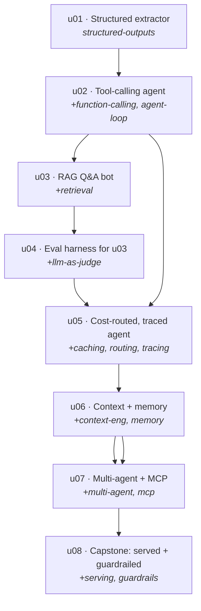

# AI-Engineering Curriculum (depth-first, spiral)

The **curated agenda** this repo's orchestrator maintains. Not a reading list — a *spiral*: each unit
deliberately **reuses** concepts from earlier units and adds a small frontier, so concepts reach **depth**
by reappearing in progressively harder contexts. Implementing each unit is the owner's separate effort.

- **Concept graph:** [`concepts.yaml`](concepts.yaml) — the DAG of topics, prerequisites, domains, and
  per-concept **mastery** (`0 unseen → 4 fluent`). A concept climbs to 3–4 only by being reused.
- **Units:** [`units/`](units/) — the buildable mini-projects, ordered foundational → capstone. Each
  carries `introduces` / `reinforces` / `builds_on`, a `depth_objective`, and a `mastery_check`.

## The seeded spine (one path through the graph)

By u08, `structured-outputs` and `function-calling` have been **reused five+ times** in harder contexts —
that reuse is what builds depth, not a single pass.

## How to use it

1. Pick the lowest-numbered unit you haven't built. Build it (separately) to hit its `depth_objective`.
2. Confirm the `mastery_check` honestly. Then bump its concepts' mastery in `concepts.yaml`
   (later: `master.py <concept> <level>`).
3. Ask the curator for the next units (later: `curate.py "next"`) — it will respect prerequisites,
   schedule **reuse of concepts due for a depth bump**, add 1–3 frontier concepts, and raise the tier.

## What's unlocked *next* (frontier, not yet in the spine)

Concepts present in the graph but not yet covered by the 8-unit spine — natural targets once the spine's
prerequisites are met: `streaming`, `reranking`, `programmatic-tool-calling`, `regression-evals`,
`telemetry-cost`, `latency-scaling`, `finetuning-lora`. The curator weaves these in (and adds new frontier
nodes from a weekly trend scan) as later spiral steps.
